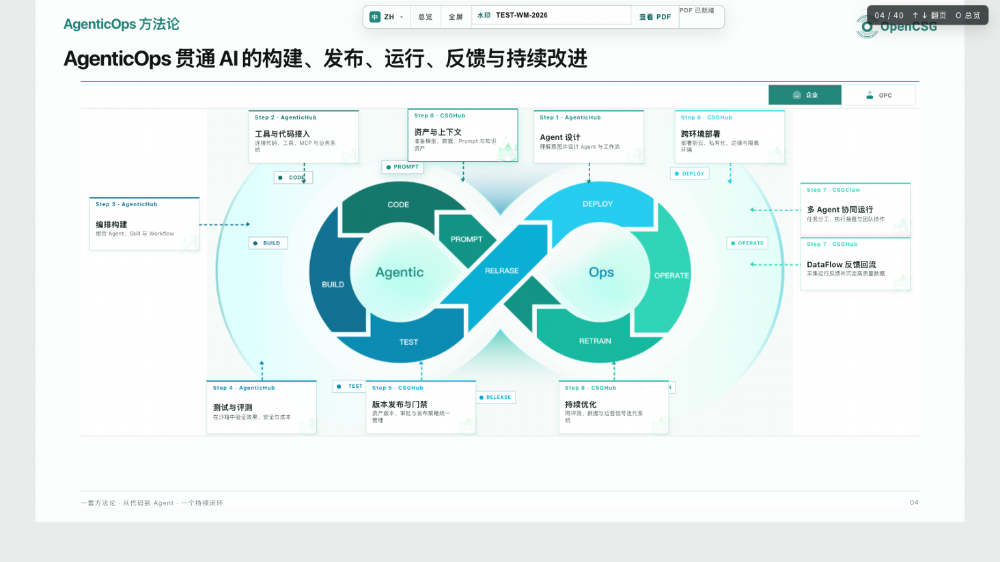
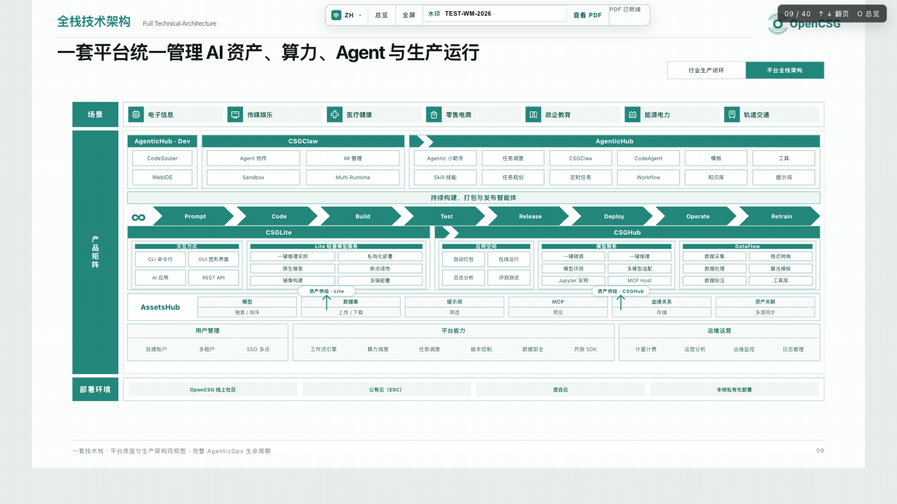
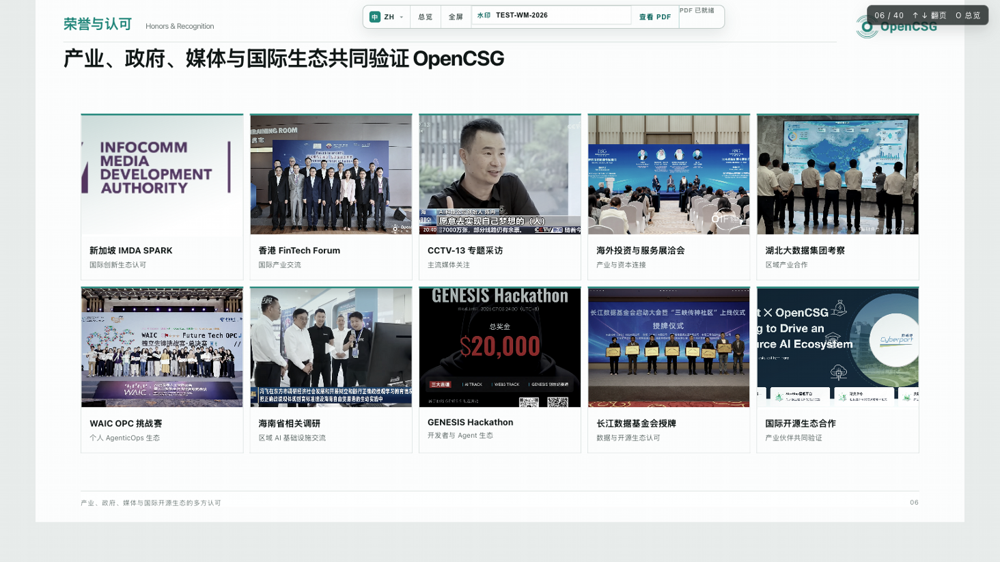
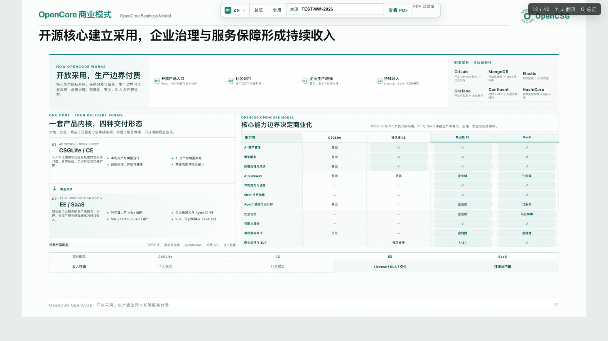
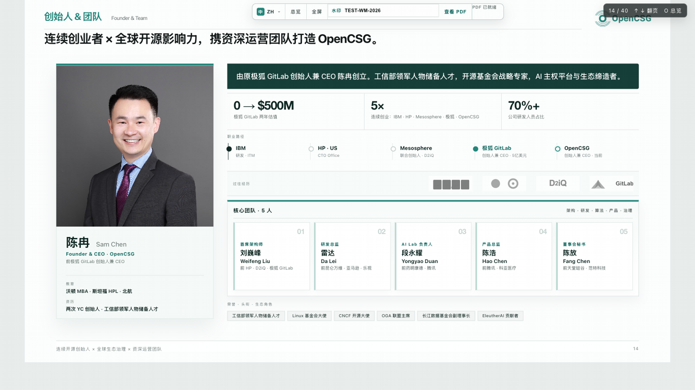
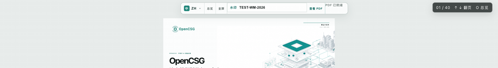

<div align="center">

# OpenCSG Investor Deck 2026
> Global Open Source · AgenticOps · AI Sovereignty · Investor Materials
> 全球开源 · AgenticOps · AI 主权 · 投资人路演材料


[Overview](#-overview) · [Quick Start](#-quick-start) · [Features](#-features) · [Repo Layout](#-repo-layout) · [Scripts](#-scripts) · [i18n](#-i18n) · [Export PDF / PPTX](#-export-pdf--pptx) · [FAQ](#-faq)

[简体中文](./README.md) | __English__

</div>

> **Recent updates (2026-07)**:
> - **Cover copy** — Main title updated to "Empowering every person with large models"; 4 bottom tags updated to "Core open source · Hybrid · Agentic-driven · Sovereign AI" (per IR reference)
> - **Appendix polish** — slide 25 capability cards equalized; slide 26 scenario descriptions aligned with footer
> - **10-language coverage** — 4 new cover tags translated for all 8 non-EN/non-ZH locales (no more English fallback)

---

## Overview

This repository hosts the **OpenCSG 2026 investor pitch deck as a single self-contained HTML file** — 40 slides, designed at 1600×900 (16:9), with on-screen navigation, PDF / PPTX export, language switching, keyboard controls, thumbnail overview mode, and inline QR codes.

The deck is plain HTML / CSS / vanilla JS — no front-end framework, no build step. A small set of Node scripts covers the operational side:

- Local static server with an export API (`npm run serve`)
- Headless PDF rendering (`npm run export:pdf`)
- Image-based PPTX packaging (`npm run export:pptx`)
- README screenshot capture from the live deck (`node scripts/capture-readme-screenshots.mjs`)

Built for **investor-facing scenarios where content, typography, and cross-locale consistency matter more than framework ergonomics**.



## Quick Start

### Requirements

| Tool | Version | Used for |
| --- | --- | --- |
| Node.js | ≥ 18 | Running scripts |
| npm | ≥ 9 | Dependency install |
| Google Chrome / Chromium | latest | Headless renderer for PDF / PPTX |
| Playwright | 1.61+ | Bundled via `devDependencies` |

### 3-step setup

```bash
# 1. Clone & install
git clone git@github.com:frankfika/OpenCSG_BP_HTML_2026.git
cd OpenCSG_BP_HTML_2026
npm install

# 2. Start the local server (defaults to 127.0.0.1:4173)
npm run serve
# Open http://127.0.0.1:4173 in a browser
```

> Port already in use? Pick another one: `PORT=4174 npm run serve`

## Features



| Module | Highlights |
| --- | --- |
| 📑 **Multi-section deck** | 40 slides in 5 sections — `cover` / `main` / `case` / `product` / `appendix`; each is exportable on its own |
| 🌍 **10 languages** | zh / en / ja / ko / ar (RTL) / ru / fr / de / es / pt |
| ⌨️ **Keyboard & touch** | `←` `→` to page, `↑` `↓` to jump section, `Home` / `End` to first/last, `Esc` to leave fullscreen, `Space` / `F` for fullscreen |
| 🧭 **Top toolbar** | Language switcher, page counter, "View PDF", PPT-ready pill, jump-to-top |
| 🔍 **Overview grid** | Top-bar "Overview" button opens a thumbnail grid of every slide |
| 🌐 **RTL support** | Arabic auto-flips the whole body to right-to-left |
| 💧 **Watermark** | Diagonal watermark on PDF / PPTX exports |
| 🖨 **Print styles** | `@media print` page-break handling for A4 / 16:9 handouts |
| 📤 **Multi-format export** | PDF (vector + image, 16:9 / 4:3 / A4 / Letter) and PPTX (full-bleed image) |
| 🔁 **PDF caching** | Server-side cache keyed by `lang + ratio + sections + watermark` so the second request is instant |
| 🎨 **Brand-locked palette** | Teal `#23877B` + amber `#C88A2B` accents, mirrored inside exported PPTX |

More slide previews:

| Community & honors | Business flywheel | Founders |
| --- | --- | --- |
|  |  |  |

## Repo Layout

```
OpenCSG_BP_HTML_2026/
├── index.html                # Entry — all 40 slides live here
├── assets/
│   ├── deck-*.css / .js      # Slide styles & behaviour
│   ├── i18n/                 # 10-language translation packs
│   ├── brand-logos/          # Open-source / vendor brand marks
│   ├── case-logos/           # Customer case logos
│   ├── customer-logos/       # Enterprise customer logos
│   ├── founder-logos/        # Founder background logos
│   ├── roadmap/              # Roadmap & OPC visual assets
│   ├── appendix/             # Appendix illustrations
│   ├── cases/                # Case-study reference imagery
│   └── *.png / *.jpg / *.svg # Shared imagery
├── scripts/
│   ├── serve-deck.cjs        # Static server + export API
│   ├── export-pdf.cjs        # PDF renderer
│   ├── export-pptx.cjs       # PPTX (image-based) packager
│   ├── export-pdf-bilingual.cjs / export-pptx-bilingual.cjs
│   ├── capture-readme-screenshots.mjs
│   └── i18n/                 # Translation audit / gen / apply
├── docs/
│   └── assets/               # Real screenshots used by this README
└── package.json
```

## Scripts

| Command | Description |
| --- | --- |
| `npm run serve` | Boot the static server (with `/api/export`) on `127.0.0.1:4173` |
| `npm run export:pdf` | Export the full deck to PDF with default options (zh / 16:9) under `.exports/` |
| `npm run export:pdf-bilingual` | Export the bilingual (zh + en) PDF bundle in one shot |
| `npm run export:pptx` | Export image-based PPTX |
| `npm run export:pptx-bilingual` | Export the bilingual (zh + en) PPTX bundle in one shot |
| `node scripts/capture-readme-screenshots.mjs` | Pull README screenshots from `127.0.0.1:4173` into `docs/assets/` |

### Export flags

```bash
# Language / ratio / section
node scripts/export-pdf.cjs --lang=en --ratio=16:9 --sections=cover,main

# Manual page list (overrides --sections)
node scripts/export-pdf.cjs --lang=zh --pages=1,3,5-8

# Range + watermark
node scripts/export-pdf.cjs --from=1 --to=10 --watermark="CONFIDENTIAL" --out=draft.pdf
```

Supported languages: `zh` `en` `ja` `ko` `ar` `ru` `fr` `de` `es` `pt`
Supported ratios:   `16:9` `4:3` `a4-portrait` `a4-landscape` `letter-landscape`
Supported sections: `cover` `main` `case` `product` `appendix`

> You can also call the REST endpoint directly:
> `POST http://127.0.0.1:4173/api/export` with a JSON body
> `{ lang, ratio, format, scope, sections, watermarkEnabled, watermarkText, filename, disposition }`.

## i18n



- 10 translation packs live in `assets/i18n/*.json`; `zh.json` is the source of truth.
- HTML elements are marked with `data-en` / `data-i18n`; the runtime swaps text based on the current language.
- Missing translations fall back to English, never to a blank string.

Workflow for adding or updating a phrase:

```bash
# 1. Update the Chinese copy in index.html + the matching data-en attribute
# 2. Append the human translations to scripts/i18n/translation-pack.json
# 3. Apply them to the 8 other packs and verify coverage
bash scripts/i18n/run-all.sh apply
bash scripts/i18n/run-all.sh audit
```

See [`assets/i18n/README.md`](./assets/i18n/README.md) for the full conventions.

## Export PDF / PPTX

### In-browser export

The **"View PDF"** button in the top toolbar triggers `ensureCachedPdf()` on the server: the first request for a given `lang + ratio + sections + watermark` combination generates the PDF and writes it to `.exports/pdf-cache/`; subsequent identical requests hit the cache.

### CLI export

```bash
# Bilingual PDF bundle
npm run export:pdf-bilingual

# Bilingual PPTX bundle
npm run export:pptx-bilingual

# Custom watermark
node scripts/export-pptx.cjs --lang=zh --watermark="DRAFT"
```

The PPTX is **fully image-based** — every slide is rendered to a 1600×900 PNG by Playwright, then packaged with `pptxgenjs`. The trade-off: layout is preserved 100% across platforms, but text is not editable inside PowerPoint. To change copy, edit `index.html` and re-export.

## Design Tokens

| Token | Value | Role |
| --- | --- | --- |
| `--teal` | `#23877B` | Primary brand color (logo, toolbar, buttons) |
| `--teal2` | `#0E675F` | Primary dark (hover / emphasis) |
| `--mint` | `#EAF4F2` | Soft background fill |
| `--amber` | `#C88A2B` | Accent for numbers and key metrics |
| `--ink` | `#111817` | Body text |
| `--muted` | `#66716F` | Secondary text |
| `--paper` | `#FCFDFD` | Page background |

> Tokens are centralized in the `:root` block of `assets/deck-base.css`; changing them once propagates everywhere.

## FAQ

<details>
<summary><b>Q1. The page is blank after starting the server.</b></summary>

- Confirm `npm install` finished (Playwright bundles a browser that needs to download).
- Check the terminal log. 80% of the time the error is `EADDRINUSE` — pick a different port with `PORT=4180 npm run serve`.
</details>

<details>
<summary><b>Q2. Japanese / Korean text shows as tofu boxes.</b></summary>

Your system is missing a CJK font. macOS / Windows ship with PingFang / Microsoft YaHei / Noto by default. The Playwright-bundled Chromium used for PDF export also relies on system fonts; if exports show tofu, install Noto Sans CJK.
</details>

<details>
<summary><b>Q3. The exported PPTX text looks blurry in PowerPoint.</b></summary>

That's intentional. The PPTX is fully image-based (1600×900 PNG per slide) for cross-platform pixel-perfect layout. If you need editable text, export to PDF and run it through a "PDF → PPTX" converter.
</details>

<details>
<summary><b>Q4. i18n didn't refresh after I edited <code>index.html</code>.</b></summary>

In the browser console:

```js
localStorage.removeItem('opencsg.deck.lang');
location.reload();
```

Or force a language via the URL: `?lang=zh`.
</details>

<details>
<summary><b>Q5. I want to add a new slide.</b></summary>

1. Duplicate an existing `<section class="slide-wrap" data-section="main">…</section>` and rewrite the copy.
2. Wrap every key phrase with `data-en="English source text"` and append the phrase to `scripts/i18n/translation-pack.json`.
3. `bash scripts/i18n/run-all.sh apply && bash scripts/i18n/run-all.sh audit`.
4. `node scripts/capture-readme-screenshots.mjs` to refresh README screenshots.
</details>

## Maintainers

- Repo: [github.com/frankfika/OpenCSG_BP_HTML_2026](https://github.com/frankfika/OpenCSG_BP_HTML_2026)
- Screenshot script: `scripts/capture-readme-screenshots.mjs`
- i18n tooling: `scripts/i18n/run-all.sh {audit|gen|apply|all}`

> This repository is currently distributed as **internal investor material**. For external use, please contact the OpenCSG brand team for licensing.
